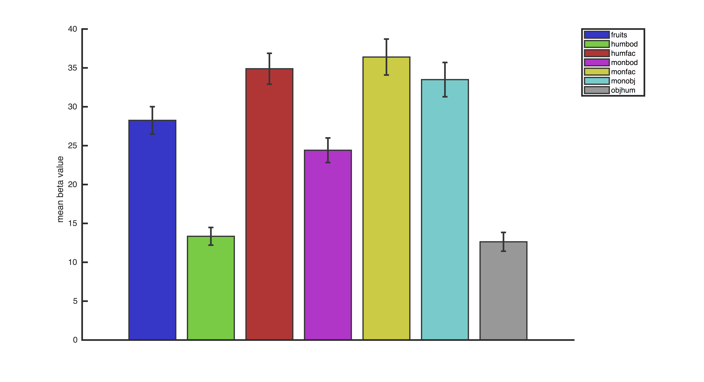

#beta_SPM
generates an bar graph of the mean and sem beta values per condition with a figure for each ROI
 
##file locations
location of spm batch file

	spmDir 	 	= '/data/fmri_monkey_03/PROJECT/codeshare/example/fmri_spm/spm_12/facebody_glm/';
	spm_matFile 	=[spmDir,'/results/SPM.mat'];
	spm_version 	= '12';

location of nifti ROIs
ROIs should be a 1-0 mask in same volume space as the beta images

	clear roiFiles
	roiDir 		= [spmDir,'/rois/'];
	roiFiles{1} 	= 'roi_test.nii';
	roiFiles{2} 	= 'roi_test2.nii';
	roiFiles{3} 	= 'roi_test3.nii';

location .eps files are printed

	printDir 	= [spmDir,'/beta_results/'];

##plotting parameters
colors of each condition in RGB values

	colorValues{1} 	= [.2 .2 .2]; 
	colorValues{2} 	= [.2 .2 .8];
	colorValues{3} 	= [.2 .8 .2];
	colorValues{4} 	= [.8 .2 .2]; 
	colorValues{5} 	= [.8 .2 .8]; 
	colorValues{6} 	= [.8 .8 .2];
	colorValues{7} 	= [.2 .8 .8]; 
	colorValues{8} 	= [.6 .6 .6]; 

flipCBV = 1;  flips signal;            for CBV imaging
flipCBV = 0;  doesn't flip signal; for BOLD imaging

	flipCBV = 1;

condition subtracted from other conditions for plotting purposes.
	
	baselineCondition = 1;

get cell array of ROIs = condition(row) X run(column) of mean beta value across roi voxels

	[roiBetaData conditionName] = perROI_Cond_by_Run(spm_matFile,roiDir,roiFiles,printDir,spm_version);

plot the bar graph of mean and sem across runs for each condition
	
	plot_MeanSem_ROIBetaData(roiBetaData,baselineCondition,flipCBV,conditionName,colorValues,roiFiles,printDir);